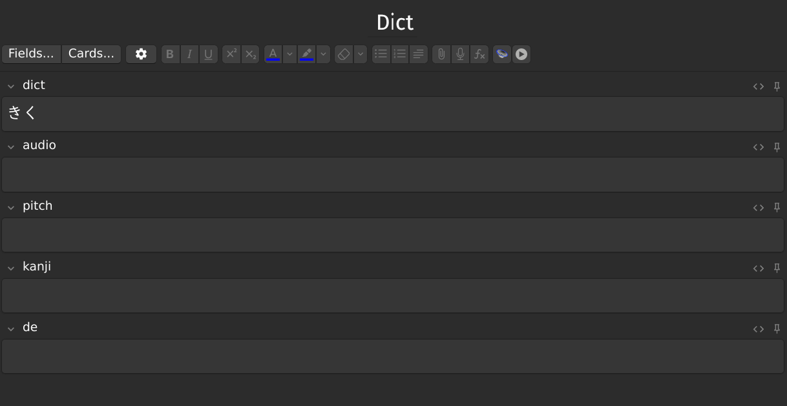

# accent-dict.jp
This Anki addon allows you to easily add audio files, accent diagrams (as SVG), and kanji to your vocabulary cards. 
It's based on a fork of the [Monokakido dictionary implementation](https://github.com/golddranks/monokakido) by golddranks. 
All the necessary assets are sourced from the [NHK dictionary](https://www.monokakido.jp/en/android/nhkaccent2/index.html).
Please note that this addon is still in development, and no shippable version is available.

## Notice

This library started as a personal project driven by curiosity.
It is NOT intended to support piracy;
I strongly condemn making unauthorized copies of Monokakido's dictionaries,
and take no part or responsibility in that kind of activity.
Please buy your dictionaries directly from Monokakido to show your love and support.

------

## Credits

- Based on a fork of the Monokakido library by [golddranks](https://github.com/golddranks/monokakido).
- Accent diagram inspired by [SVG_pitch](https://github.com/IllDepence/SVG_pitch).
